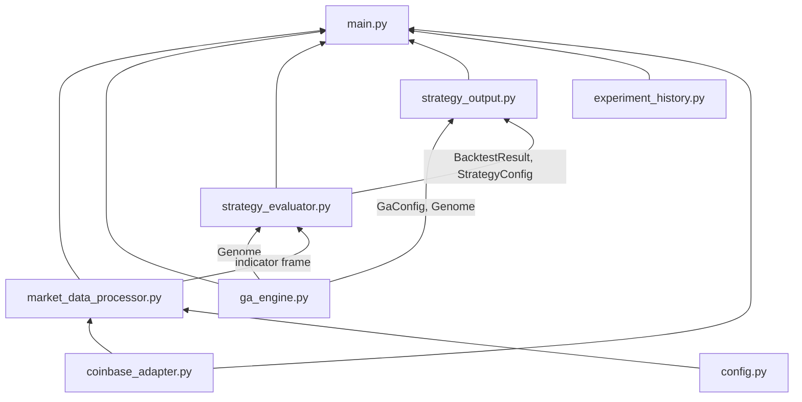
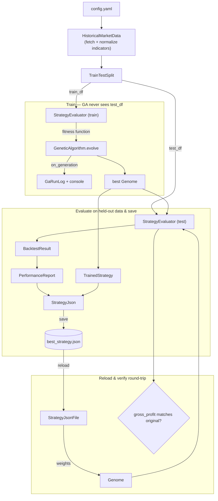

# GA Crypto Trading Module

Trains a genetic algorithm to weight five technical indicators (SMA short/long/extra,
RSI, MACD) into a single buy/sell signal for one Coinbase pair, backtests the result
on held-out data, and persists the winning strategy as JSON.

## Architecture

Six independent, individually-tested modules. Arrows show what each module imports
from another (i.e. "provides → consumes"):



| File | Responsibility |
|---|---|
| `market_data_processor.py` | Fetches Coinbase OHLCV candles (auto-chunked/paginated, disk-cached), computes SMA/RSI/MACD, min-max normalizes them to `[0, 1]`, splits into train/test, exposes a live account+price snapshot |
| `ga_engine.py` | Genome (a normalized weight vector), and the GA operators that evolve a population against a pluggable `FitnessFunction`: tournament selection, uniform crossover, Gaussian mutation, elitism |
| `strategy_evaluator.py` | Turns a genome's weights into a per-candle `signal_score`, walks the candles as a single-position backtest (buy above threshold, sell below, force-close at the end), and reports gross profit — this *is* the `FitnessFunction` the GA evolves against |
| `strategy_output.py` | Assembles a trained genome + its config + its test-set performance into the `best_strategy.json` schema, saves/reloads it, and logs per-generation GA progress to a run log |
| `experiment_history.py` | Gives every run a `run_id`, snapshots its resolved config/strategy/log under `experiments/<run_id>/`, and appends one leaderboard row (hyperparameters + performance + git commit) to `experiments/index.csv` |
| `main.py` | Orchestrates all five: fetch → split → train on `train_df` → evaluate the winner on `test_df` → save (both the "current" strategy file and this run's own history entry) → reload from disk → verify the reload reproduces the same backtest result |

## Pipeline (`main.py`)



The GA's fitness function is wired to `train_df` only; `test_df` is held out until
the winning genome is fixed, so the saved `performance` numbers are an honest,
out-of-sample estimate rather than the (optimistic) number the GA was optimizing.

## Configuration (`config.yaml`)

| Section | Key | Meaning |
|---|---|---|
| `data` | `pair`, `granularity` | Coinbase-format product ID and candle interval (e.g. `BTC-USDC`, `ONE_HOUR`) |
| | `start_date`, `end_date` | Historical window to fetch, `YYYY-MM-DD` |
| | `test_split` | Fraction of the window held out for out-of-sample evaluation |
| `market_data` | `cache_dir` | Directory where fetched candle windows are cached to disk (JSON, keyed by pair/granularity/start/end) — a repeated fetch of the same window reads from here instead of Coinbase |
| | `normalized_columns`, `delta_columns` | Which indicator/delta columns get min-max normalized into `norm_<column>` before scoring |
| `strategy` | `indicators` | SMA/RSI/MACD periods |
| | `buy_threshold` / `sell_threshold` | `signal_score` levels that open / close a position (hysteresis band between them = hold) |
| | `position_size_pct` | Fraction of the *current* simulated balance risked per trade (compounding) |
| | `starting_balance` | Fixed quote-currency balance a backtest starts from — not read from a live account, so training is deterministic and reproducible |
| | `weight_keys` | Which `market_data.normalized_columns` the GA assigns a weight to and scores on (must be a subset of `normalized_columns` — checked at startup) |
| | `unwind_at_entry_price` | If true (default), a still-open position at the end of a backtest is force-closed at its own entry price (net-zero, not counted as a win or loss) instead of the window's last market price — so a strategy isn't judged on wherever the window happened to cut off mid-hold |
| `genetic_algorithm` | `population_size`, `generations`, `mutation_rate`, `crossover_rate`, `tournament_size`, `elitism_count`, `mutation_sigma`, `seed` | Standard GA hyperparameters; fix `seed` for reproducible runs |
| `output` | `strategy_filepath`, `log_filepath` | Where the *current* trained strategy JSON and per-generation run log get written — overwritten/appended by every run, this is what `dry_run.py` reloads |
| | `experiments_dir`, `index_filepath` | Where every run's own history is kept instead — `experiments/<run_id>/` (never overwritten) and the `experiments/index.csv` leaderboard row for it |

## Usage

Requires live Coinbase credentials in `coinbase/credentials.py` (see the repo-root
README) — there is no sandbox, so training runs against real historical market data.

```bash
python coinbase/ga/main.py
```

This prints per-generation `best`/`avg` fitness as training proceeds, then a summary:

```
Saved strategy to ./best_strategy.json
Experiment run_id:      20260819T140322Z-9f3a1c2e
Test-set gross profit: 187.42
Total trades:          14
Win rate:              57.1%
Max drawdown:           9.8%
Reload round-trip:     OK
```

### Output artifacts

**`best_strategy.json`** — see `StrategyJson`/`StrategyJsonFile` in `strategy_output.py`
for the exact schema: `metadata` (pair, timeframe, training period, full GA config,
timestamp), `strategy` (weights + buy/sell/position-size hyperparameters), and
`performance` (gross profit, trade count, win rate, max drawdown, avg profit/trade —
all computed on the held-out test split). Overwritten by every run — this is the
"current" strategy `dry_run.py` reloads.

**`ga_run_log.txt`** — appended to (never overwritten), one section per run. Each run
opens with a header (`RunHeader` in `strategy_output.py`) written before the GA starts,
so a run that crashes mid-evolution still leaves its config on record: a
`=== run <started_at ISO-8601> ===` line, the pair/granularity/date window/test split,
the strategy hyperparameters, and the GA config — followed by one tab-separated line per
generation: `generation\tbest_fitness\tavg_fitness`.

**`experiments/<run_id>/`** — one subdirectory per run, never overwritten, holding that
run's exact `config.json` (the fully resolved config used, not just `config.yaml`),
`strategy.json` (identical content to `best_strategy.json` at save time), and its own
`run_log.txt` (this run's generations only, not the shared log above). `run_id` is a
UTC timestamp plus a short hash of the resolved config, so two runs never collide even
with the same config re-run — see `RunId` in `experiment_history.py`.

**`experiments/index.csv`** — one row appended per run: `run_id`, `started_at`,
`git_commit`, the data window, every GA/strategy hyperparameter, and the test-set
performance metrics. A flat leaderboard for comparing runs (e.g. via pandas) without
opening each one's `strategy.json`.

### Tests

```bash
pytest tests/test_market_data_processor.py tests/test_ga_engine.py \
       tests/test_strategy_evaluator.py tests/test_strategy_output.py \
       tests/test_experiment_history.py tests/test_main.py
```

All tests run against fake/mocked adapters — no live credentials or network access
required. Only `python coinbase/ga/main.py` itself needs real credentials.

### Design decisions worth knowing

- **Position sizing compounds** off the running simulated balance, not the original
  `starting_balance` — a losing streak shrinks subsequent position sizes, a winning
  streak grows them, matching how the account would actually behave live.
- **An open position at the end of the backtest window is force-closed** at the final
  candle's close and counted in `gross_profit`, rather than ignored as unrealized —
  otherwise a genome that buys near the window's end and never gets to sell would
  show misleadingly low fitness despite holding a paper gain.
- **`starting_balance` is a fixed config value**, not a live account balance, so that
  training and backtesting are deterministic and don't require live credentials to
  reason about (only `main.py`'s actual data fetch does).
