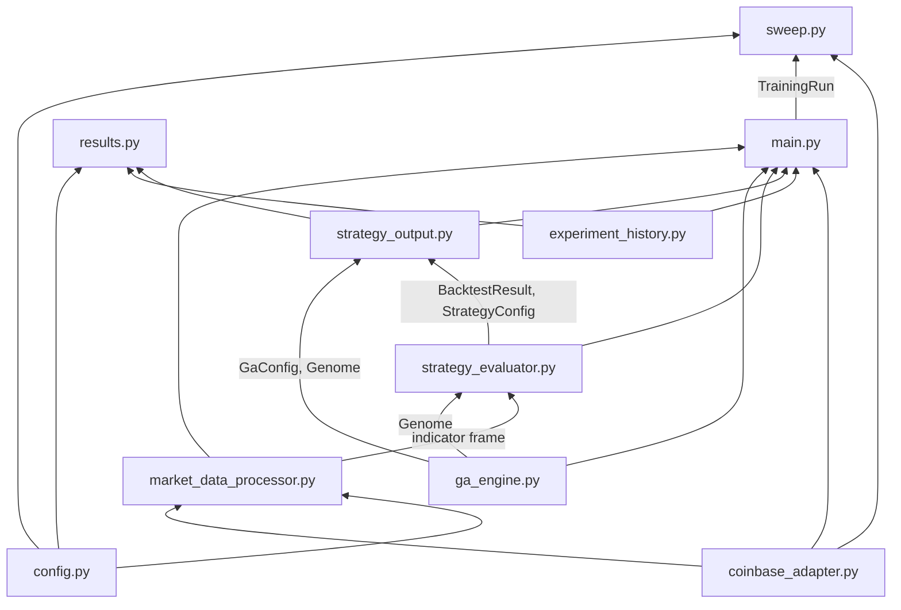
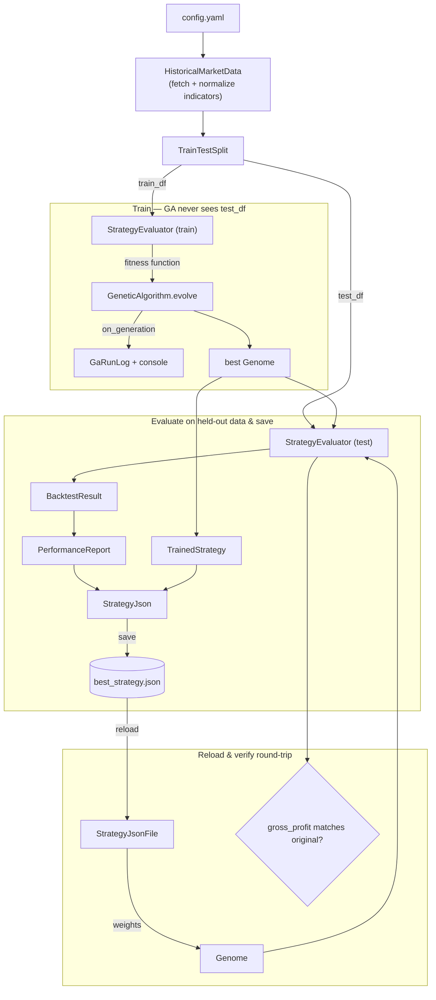

# GA Crypto Trading Module

Trains a genetic algorithm to weight five technical indicators (SMA short/long/extra,
RSI, MACD) into a single buy/sell signal for one Coinbase pair, backtests the result
on held-out data, and persists the winning strategy as JSON.

## Architecture

Eight independent, individually-tested modules. Arrows show what each module imports
from another (i.e. "provides → consumes"):



| File | Responsibility |
|---|---|
| `market_data_processor.py` | Fetches Coinbase OHLCV candles (auto-chunked/paginated, disk-cached), computes SMA/RSI/MACD, min-max normalizes them to `[0, 1]`, splits into train/test, exposes a live account+price snapshot |
| `ga_engine.py` | Genome (a **signed** weight vector, normalized so the absolute weights sum to 1 — a negative weight reads its indicator as bearish), and the GA operators that evolve a population against a pluggable `FitnessFunction`: tournament selection, uniform crossover, Gaussian mutation, elitism |
| `strategy_evaluator.py` | Turns a genome's weights into a per-candle `signal_score` — the weighted sum mapped onto `[0, 1]` as `(s + 1) / 2`, so **neutral is 0.5** — walks the candles as a single-position backtest (buy above threshold, sell below, force-close at the end), and reports profit net of fees and borrow interest — this *is* the `FitnessFunction` the GA evolves against |
| `strategy_output.py` | Assembles a trained genome + its config + its test-set performance into the `best_strategy.json` schema, saves/reloads it, and logs per-generation GA progress to a run log |
| `experiment_history.py` | Gives every run a `run_id`, snapshots its resolved config/strategy/log under `experiments/<run_id>/`, and appends one leaderboard row (hyperparameters + performance + git commit) to `experiments/index.csv` |
| `main.py` | Orchestrates all five: fetch → split → train on `train_df` → evaluate the winner on `test_df` → save (both the "current" strategy file and this run's own history entry) → reload from disk → verify the reload reproduces the same backtest result |
| `sweep.py` | Reads `sweep.yaml`, expands it into one-factor-at-a-time config variants (× seed repeats), and runs `main.py`'s `TrainingRun` sequentially over each — no changes to any other module |
| `results.py` | Reads back `experiments/index.csv` (leaderboard / group-by-parameter comparison) or one run's `run_log.txt` (GA convergence) — read-only, no training, no network access |

## Sweeping (`sweep.py`)

`main.py` trains one strategy for whatever `config.yaml` says. `sweep.py` trains many,
by varying one parameter at a time against a shared base config:

```bash
python -m coinbase.ga.sweep
```

`sweep.yaml` defines the sweep:

```yaml
base_config: "coinbase/ga/config.yaml"
seeds: [1, 2, 3, 4, 5]
axes:
  - path: "genetic_algorithm.mutation_rate"
    values: [0.05, 0.1, 0.2, 0.4]
  - path: "strategy.buy_threshold"
    values: [0.5, 0.6, 0.7]
```

| Key | Meaning |
|---|---|
| `base_config` | Path to the config every point starts from — only the fields listed below are overridden per point |
| `seeds` | Every axis value is trained once per seed listed here (`genetic_algorithm.seed` override), so results report as mean/spread across seeds rather than one possibly-lucky run |
| `axes` | Each `path` is a dotted `config.yaml` key (e.g. `strategy.buy_threshold`); each `values` entry becomes one point, with every *other* axis held at `base_config`'s value — this is what makes it one-factor-at-a-time rather than a full grid |

A sweep with 2 axes of 3 values each and 5 seeds trains `(3 + 3) × 5 = 30` points — not
`3 × 3 × 5`, because axes never combine with each other, only with seeds. Each point is
an unmodified `TrainingRun.train()` call, so it gets its own `experiments/<run_id>/`
history and `experiments/index.csv` row exactly like a `main.py` run — group by
`axis_path`/the varied column in the index to compare a sweep's results.

Points run **sequentially, not concurrently**: most axes only touch strategy/GA
hyperparameters, so every point after the first reuses `market_data.cache_dir`'s
already-fetched candles instead of racing several cold fetches of the same window.

`TrainingRun.train()` always overwrites `output.strategy_filepath` — the "current"
strategy `dry_run.py` reloads. A sweep redirects every point's `strategy_filepath` to a
shared `experiments/_sweep_scratch/best_strategy.json` instead, so running a sweep can
never clobber the canonical file with whatever point happened to train last; each
point's real, permanent record is still its own `experiments/<run_id>/strategy.json`.

Joint/combined sweeps (varying two parameters together) are deliberately out of scope —
see `MODEL_DEVELOPMENT_PLAN.md` step 3, which reserves that for a later, narrower random
search once one-factor-at-a-time results identify which parameters are worth combining.

## Comparing results (`results.py`)

A sweep (or several separate `main.py` runs) produces one row per run in
`experiments/index.csv`. `results.py` reads it back — no training, no network access,
no credentials needed:

```bash
python -m coinbase.ga.results                          # top 20 runs by annualized_yield
python -m coinbase.ga.results --top 10 --pair FET-USDC  # filter to one pair
python -m coinbase.ga.results --group-by mutation_rate  # compare a swept parameter
python -m coinbase.ga.results --run-log <run_id>        # one run's per-generation fitness
```

`--group-by` is how you actually read a sweep's result: since each OFAT axis varies
exactly one config path, and that path already has its own column in the index (e.g.
`genetic_algorithm.mutation_rate` → the `mutation_rate` column), grouping by that column
directly gives count/mean/std/min/max of `--metric` per value — no separate "which axis
was varied" bookkeeping needed. `--metric` defaults to `annualized_yield` but accepts any
numeric column in the index (`gross_profit`, `win_rate`, `max_drawdown`, ...).

`--run-log` is the convergence sanity check from `MODEL_DEVELOPMENT_PLAN.md` §6: it
prints one run's `best_fitness`/`avg_fitness` per generation from its
`experiments/<run_id>/run_log.txt`, so you can eyeball whether the GA actually converged
for that run rather than trusting the final number in isolation.

**Run as a module** (`python -m coinbase.ga.results`), not as a direct script path — this
applies to every entry point in this module (`main.py`, `sweep.py`, `dry_run.py`
included), not just `results.py`: running `python coinbase/ga/results.py` directly fails
with `ModuleNotFoundError: No module named 'coinbase'`, because Python only adds the
script's own directory to `sys.path`, not the repo root, so the `coinbase` package can't
resolve. `python -m coinbase.ga.results` resolves it correctly via the current directory
instead.

## Pipeline (`main.py`)



The GA's fitness function is wired to `train_df` only; `test_df` is held out until
the winning genome is fixed, so the saved `performance` numbers are an honest,
out-of-sample estimate rather than the (optimistic) number the GA was optimizing.

## Configuration (`config.yaml`)

| Section | Key | Meaning |
|---|---|---|
| `data` | `pair`, `granularity` | Coinbase-format product ID and candle interval (e.g. `BTC-USDC`, `ONE_HOUR`) |
| | `start_date`, `end_date` | Historical window to fetch, `YYYY-MM-DD` |
| | `test_split` | Fraction of the window held out for out-of-sample evaluation |
| `market_data` | `cache_dir` *(optional)* | Directory where fetched candle windows are cached to disk (JSON, keyed by pair/granularity/start/end) — a repeated fetch of the same window reads from here instead of Coinbase. Defaults to `~/.coinbase/ga/candle_cache` |
| | `normalized_columns`, `delta_columns` | Which indicator/delta columns get min-max normalized into `norm_<column>` before scoring |
| `strategy` | `indicators` | SMA/RSI/MACD periods |
| | `buy_threshold` / `sell_threshold` | `signal_score` levels that open / close a position (hysteresis band between them = hold) |
| | `position_size_pct` | Fraction of the *current* simulated balance risked per trade (compounding) |
| | `starting_balance` | Fixed quote-currency balance a backtest starts from — not read from a live account, so training is deterministic and reproducible |
| | `weight_keys` | Which `market_data.normalized_columns` the GA assigns a weight to and scores on (must be a subset of `normalized_columns` — checked at startup). Weights are signed; an all-positive genome can never score below 0.5, so it can never sell or short |
| | `fee_bps` / `borrow_bps_per_hour` | Trading costs, both `0.0` by default. A fee is charged per leg on the notional that changed hands; borrow interest accrues only against an open short, for the hours it is held |
| | `unwind_at_entry_price` | If true (default), a still-open position at the end of a backtest is force-closed at its own entry price (net-zero, not counted as a win or loss) instead of the window's last market price — so a strategy isn't judged on wherever the window happened to cut off mid-hold |
| `genetic_algorithm` | `population_size`, `generations`, `mutation_rate`, `crossover_rate`, `tournament_size`, `elitism_count`, `mutation_sigma`, `seed` | Standard GA hyperparameters; fix `seed` for reproducible runs |
| `output` | `strategy_filepath`, `log_filepath` *(both optional)* | Where the *current* trained strategy JSON and per-generation run log get written — overwritten/appended by every run, this is what `dry_run.py` reloads. Default to `~/.coinbase/ga/best_strategy.json` / `ga_run_log.txt` |
| | `experiments_dir`, `index_filepath` *(both optional)* | Where every run's own history is kept instead — `<experiments_dir>/<run_id>/` (never overwritten) and the leaderboard CSV. Default to `~/.coinbase/ga/experiments` / `~/.coinbase/ga/experiments/index.csv` |

Every path in `output` and `market_data.cache_dir` is optional and, unless overridden,
resolves under `~/.coinbase/ga/` — outside the repo, so every git worktree of this
checkout shares one cache and one results history instead of each accumulating its own.
`config.yaml` ships with these commented out; uncomment any of them to point a specific
worktree/run at a different location.

## Usage

Requires live Coinbase credentials in `~/.coinbase/credentials.yaml` (see the repo-root
README) — there is no sandbox, so training runs against real historical market data.

```bash
python -m coinbase.ga.main
```

This prints per-generation `best`/`avg` fitness as training proceeds, then a summary:

```
Saved strategy to ./best_strategy.json
Experiment run_id:      20260819T140322Z-9f3a1c2e
Test-set gross profit: 187.42
Total trades:          14
Win rate:              57.1%
Max drawdown:           9.8%
Reload round-trip:     OK
```

### Output artifacts

**`best_strategy.json`** — see `StrategyJson`/`StrategyJsonFile` in `strategy_output.py`
for the exact schema: `metadata` (pair, timeframe, training period, full GA config,
timestamp), `strategy` (weights + buy/sell/position-size hyperparameters), and
`performance` (gross profit, trade count, win rate, max drawdown, avg profit/trade —
all computed on the held-out test split). Overwritten by every run — this is the
"current" strategy `dry_run.py` reloads.

**`ga_run_log.txt`** — appended to (never overwritten), one section per run. Each run
opens with a header (`RunHeader` in `strategy_output.py`) written before the GA starts,
so a run that crashes mid-evolution still leaves its config on record: a
`=== run <started_at ISO-8601> ===` line, the pair/granularity/date window/test split,
the strategy hyperparameters, and the GA config — followed by one tab-separated line per
generation: `generation\tbest_fitness\tavg_fitness`.

**`experiments/<run_id>/`** — one subdirectory per run, never overwritten, holding that
run's exact `config.json` (the fully resolved config used, not just `config.yaml`),
`strategy.json` (identical content to `best_strategy.json` at save time), and its own
`run_log.txt` (this run's generations only, not the shared log above). `run_id` is a
microsecond-precision UTC timestamp plus a random suffix, so two runs never collide
even when a sweep re-runs the exact same config within the same second — see `RunId` in
`experiment_history.py`.

**`experiments/index.csv`** — one row appended per run: `run_id`, `started_at`,
`git_commit`, the data window, every GA/strategy hyperparameter (including
`fee_bps` and `borrow_bps_per_hour`), and the test-set performance metrics
(`gross_profit`, `net_profit`, `fees_paid`, `interest_paid`, `annualized_yield`,
`total_trades`, `win_rate`, `max_drawdown`). A flat leaderboard for comparing runs
(e.g. via pandas) without opening each one's `strategy.json`.

The header is written once, so an index created before the cost columns existed
cannot take new rows: `ExperimentIndex.ensure_appendable()` raises rather than
misalign it, and `TrainingRun` checks up front rather than after a long run.
Archive or delete the old file and a fresh index starts. Note also that
`annualized_yield` now compounds **net** profit — a run scored with non-zero rates
is not comparable with one scored at `0.0`, which is why both rates are columns.

### Tests

```bash
pytest tests/test_market_data_processor.py tests/test_ga_engine.py \
       tests/test_strategy_evaluator.py tests/test_strategy_output.py \
       tests/test_experiment_history.py tests/test_main.py tests/test_sweep.py \
       tests/test_results.py
```

All tests run against fake/mocked adapters — no live credentials or network access
required. Only `python -m coinbase.ga.main`/`sweep`/`dry_run` themselves need real
credentials — `results.py` never touches the network.

### Design decisions worth knowing

- **Position sizing compounds** off the running simulated balance, not the original
  `starting_balance` — a losing streak shrinks subsequent position sizes, a winning
  streak grows them, matching how the account would actually behave live.
- **An open position at the end of the backtest window is force-closed** at the final
  candle's close and counted in `gross_profit`, rather than ignored as unrealized —
  otherwise a genome that buys near the window's end and never gets to sell would
  show misleadingly low fitness despite holding a paper gain.
- **`starting_balance` is a fixed config value**, not a live account balance, so that
  training and backtesting are deterministic and don't require live credentials to
  reason about (only `main.py`'s actual data fetch does).
